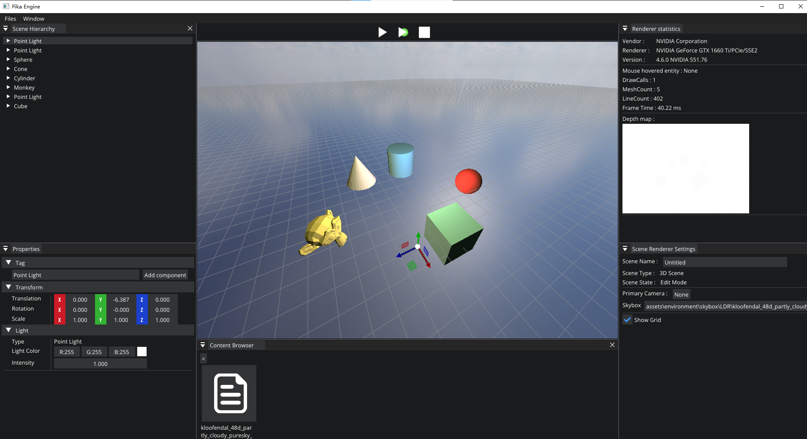
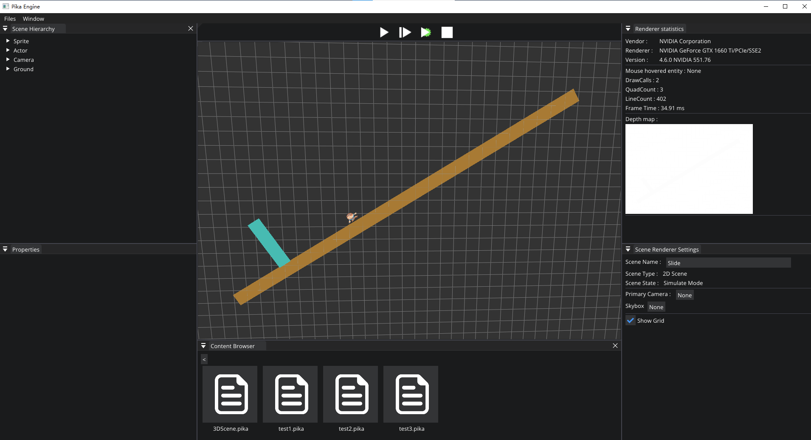

# Pika Engine
Welcome to Pika Engine! 🎉

Pika Engine 是个人独立开发的渲染引擎，旨在将我之所学付诸于实现。

现阶段的Pika Engine 已初步具备的2D引擎特征，Pika3D正在开发中...
## Getting Started
Visual Studio 2022 is recommended, Pika is officially untested on other development environments whilst I focus on a Windows build.

1. Downloading the repository:
   
   Start by cloning the repository with git clone --recursive git@github.com:ssgaryss/Pika.git.
   
   If the repository was cloned non-recursively previously, use git submodule update --init to clone the necessary submodules.

3. Configuring the dependencies:
   
   Run the Windows-GenProject.bat file found in scripts folder. This will build the project with VS2022.
## Demo
### Pika3D (Point Lights & Blinn-Phone Material)

### Pika2D (2D Physical effects)

   
